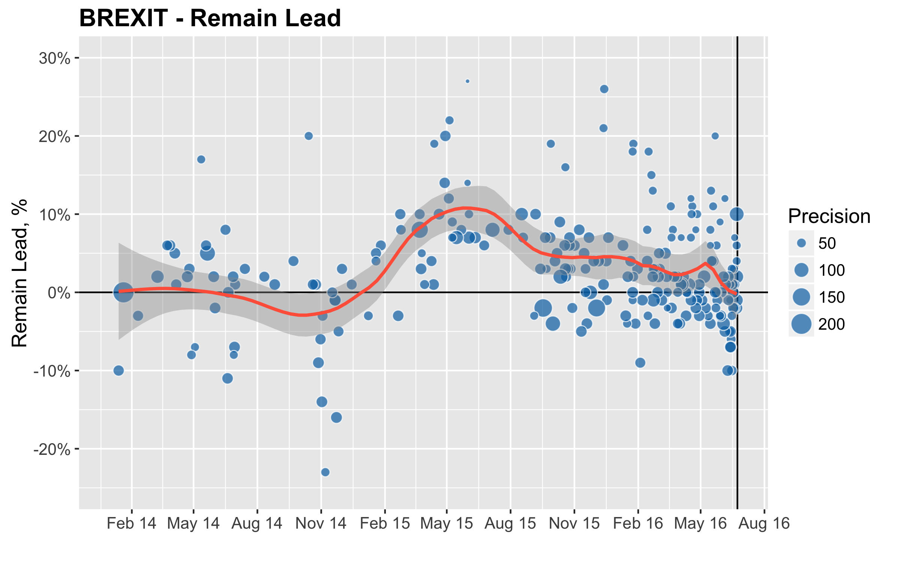
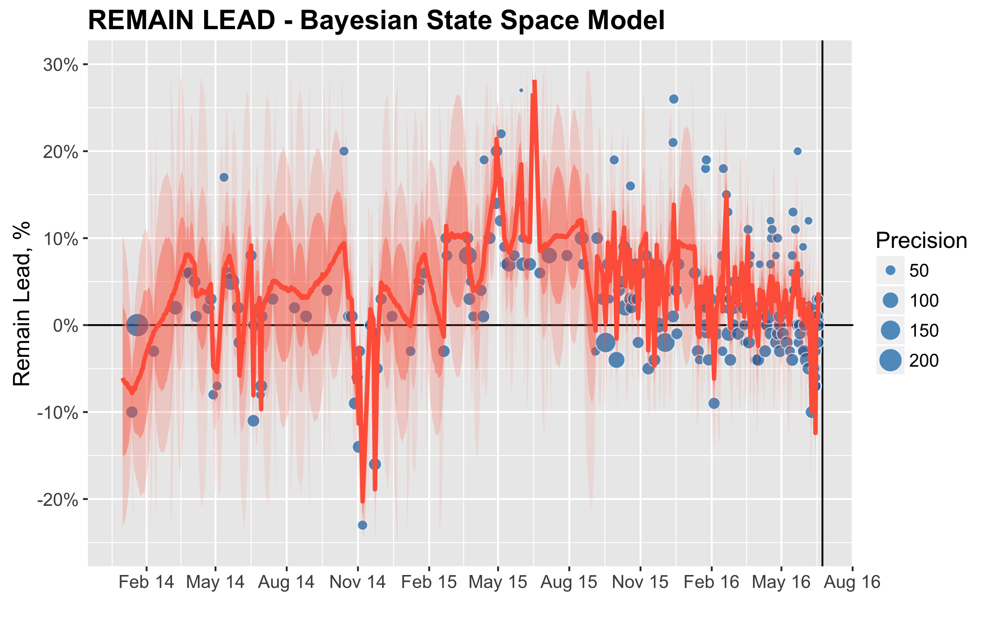
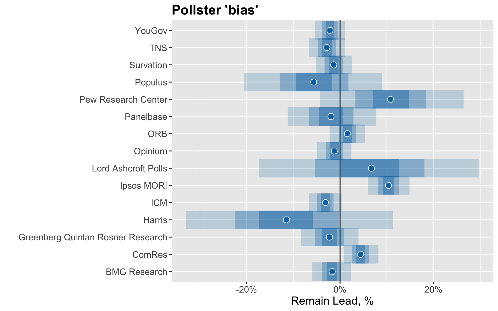
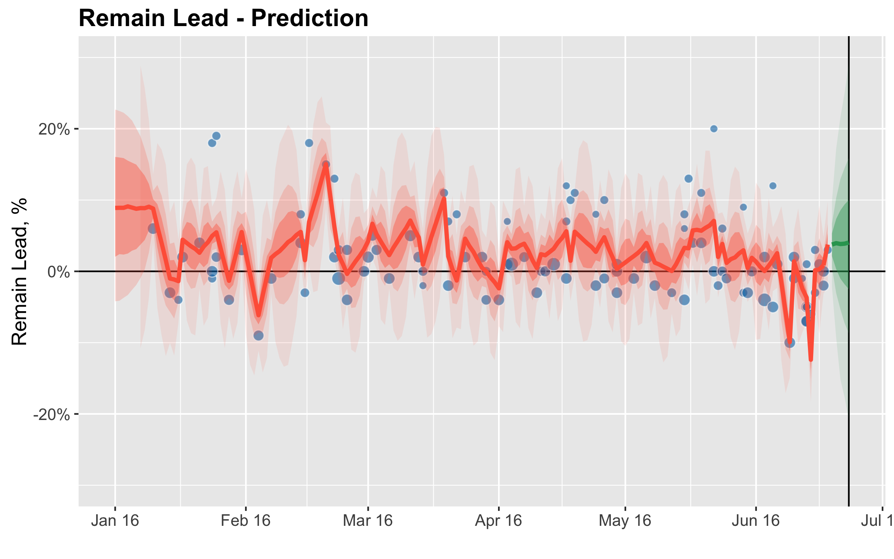
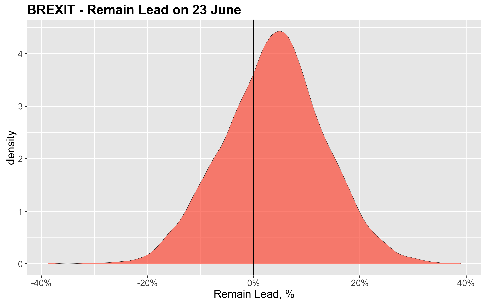

Pollsters have come in for a lot of stick since the last election.  How did they get it so wrong?  Was it that their sample sizes were too small, that their interviewing methods were biased or their re-weighting wonky.  Maybe, more simply, people just dont tell them the truth about how they will vote - or even know themselves.  Of course, its not just the pollsters that can confuse.  Through their scientific fog seeps the spin - the latest poll, the trend, the momentum, the editors desire to influence.

But, if we are trying to figure out whether the UK will 'Brexit' this week, the trouble is all we have is the polls.  So how do we screw as much useful information out of them as possible?

Well one way is to use Bayesian methods.  

The headline polls have shown "Brexit" steadily erode the "Remain" lead, particularly since the campaign began in earnest.  The chart shows the "Remain" lead over the last two and a half years with larger dots representing more precise estimates.

But is this a trend or momentum?  How can we aggregate polls from different companies, using different methods and sample sizes, to make a coherent forecast for 23rd June?

One way is to use Bayesian State Space model (see Simon Jackman http://jackman.stanford.edu/papers/).  The idea is that there is an underlying, latent public opinion that is sampled by the published polls.  These polls differ not only in what they tell us about this underlying latent preference, but also in their quality (eg the sample size and the methodology). So the model is weighted to take greater account of the more reliable polls. The underlying preference evolves over time.

More specifically

- $\mu_{t} \sim N(\mu_{t-1},\sigma)$ The latent public opinion, expressed as the lead for remain, is a normally distributed random walk, where sigma is estimated from the data.  The underlying preference is estimated for each day since 1st Jan 2014.
- $lead_{t,i} \sim N(\mu_{t} + pollster_{i}, \sigma_{lead, i,t})$ The model is measured against the polled lead for remain at time t for pollster i.  This approach can measure the bias for each pollster.

The model is estimated using [stan](http://mc-stan.org/) and the code is available [on github here](https://github.com/simeond/Brexit).

The chart shows how the model can unpick the underlying lead, day by day, that is most consistent with the polls.  There is still a lot of daily volatility, reflecting how close the race is, how different the polls have been and that this is a model of the 'lead' (which is twice as volatile as the share of vote).

There are systematic 'biases' from each pollster's methodology to either 'Brexit' or 'Remain'. For example, IPSOS MORI are biased toward 'Remain' and YouGov toward 'Brexit' This might be the sample method, re-weighting calculations etc.  This is one of the reasons it is hard just eyeball the raw poll averages.  A trend can appear just because of a sequence of pollsters.

Putting this together we can forecast the last few days of the campaign.  Of course, this requires the assumption that 'everything else remains the same' - which is the most improbable thing of all!

So this simple model reckons that, as of Sunday 19th June, there is 66% chance of a 'Remain' victory on 23rd June with the average lead being 3%pts.  

But don't rush to the conclusion that this model is secretly receiving EU funding.  The same model a week ago was predicting the exact opposite result: a 60% chance of 'Brexit'.

When the county is on a knife-edge, small shifts in information make a big difference.  Half a week is a long time in politics.
